# Index:

1. Summary of project
2. UX/UI 
3. Comprehensive Feature List 
4. Structure of Website
5. Technologies Used
6. Testing Steps
7. Future Features Implementation / Bugs
8. Deployment Steps
9. Credits

## 1. Summary of Project

Welcome to the [P,U,Z,Z,L,E].Join() Store!

A Jigsaw Puzzle E-Commerce Store for all puzzle lovers! You can find different kinds of jigsaw puzzles here, from beginner friendly ones, to 3D and irregular shaped jigsaw puzzles for anyone who is up for a good challenge!

URL of Admin Site: https://ywy-puzzle-store-project.herokuapp.com/

URL of User website: 

## 1A. Users, User Goals (User Story and Acceptance Criteria)

**B2C: Jigsaw Puzzle Enthusiasts**

User Story:
 
- There are not many physical/online jigsaw puzzle speciality stores in Singapore, so it is difficult for users to find unique and/or interesting jigsaw puzzles in Singapore. 
- Most of the time users have to find and purchase them through overseas shopping platforms and it may take quite some time for the items to arrive in Singapore.

Acceptance Criteria:
 
- Through this site, users can find all kinds of interesting jigsaw puzzles which are brought into Singapore locally.

- Reduce the waiting time for the user to receive the item and start enjoying and piecing the puzzle together.

**Market Segments**

- Children: Parents purchasing educational jigsaw puzzles for their child. Education jigsaw puzzles can help children learn logical thinking and problem solving skills.
Goals of parents: Motivate and encourage critical thinking of their kids through fun puzzles. Therefore the product line needs to be fun and at the same time educational.

- Adult with purchasing power / credit card (Above 18 years old) : Puzzle enthusiasts who seek to find unique and challenging jigsaw puzzles. 
Characteristics of such puzzle lovers: Analytical, logical thinking, focused, have high level of concentration, serious.

## 1B. Site Owner Goals

**Short term goal:**

- Sell and profit from bringing in educational as well as challenging jigsaw puzzles from all around the world.

**Long term goal:**

- Promote and grow the jigsaw puzzle enthusiasts community in Singapore.
- Collaborating with various brands to create jigsaw puzzles as merchandise and grow our own jigsaw puzzle brand.

## 2. UX/UI (Five Planes of UI/UX)
## 2A. Strategy

**User: Puzzle Enthusiasts (Business to Customer)**

User Needs: 
- Find unique and challenging jigsaw puzzles
- Receive them in the shortest possible time frame

User Pain Points: 
- Difficult to find unique and challenging jigsaw puzzles locally
- Find and purchase them from online overseas stores which take a long time to be delivered

Goal: 
Online jigsaw puzzle store located locally in Singapore which brings in jigsaw puzzles therefore reducing the time taken for user to receive the items

**User: Children (Business to Customer)**

User Needs: 
- Parents finding educational jigsaw puzzles for their kids

User Pain Points: 
- Hard to find educational jigsaw puzzle games locally

Goal: 
Bring in educational jigsaw puzzles to our e-commerce store

## 2B. Scope

**ERD Diagram**
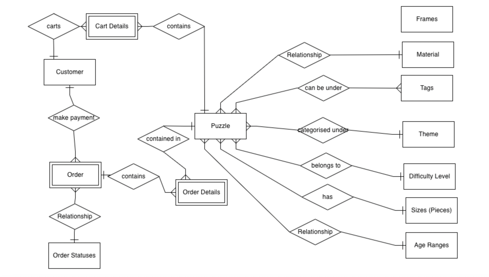

**Logical Schema Diagram**
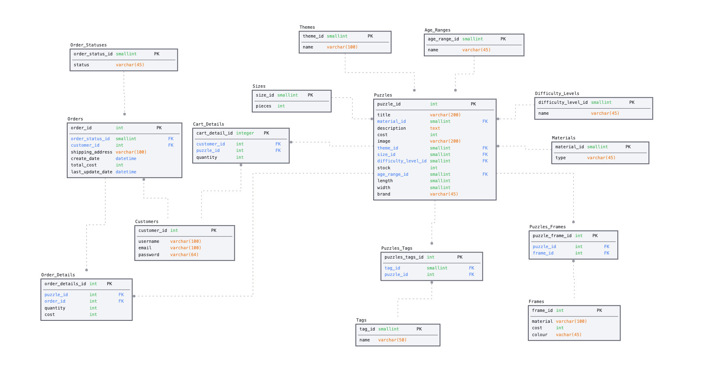

**Site Owner**
**Functional Features**
- Login/Logout as a main owner
- Create Listings
- Edit Listings
- Delete Listings
- View All Orders
- Update status of orders
- Delete Orders
- View / Create / Update / Delete Themes, Tags
- View All Users
- Delete Users

**Site Manager**
**Functional Features**
- Login/Logout as a manager
- Create Listings
- Edit Listings
- Delete Listings
- View All Orders
- Update status of orders
- Delete Orders
- View, Create / Update / Delete Themes, Tags

**Users**
**Functional Features**
- Login/Logout as a user
- Create a new user account
- View all puzzle listings
- Filter by various criterias (Eg. Keyword, Themes, Tags, Sizes, Difficulty Levels)
- Add item to cart
- Checkout items in cart
- Make payment for the items
- View status of item (EG. Paid / Order Received / Out for delivery /  Delivered)

## 2C. Structure

**Admin Site**

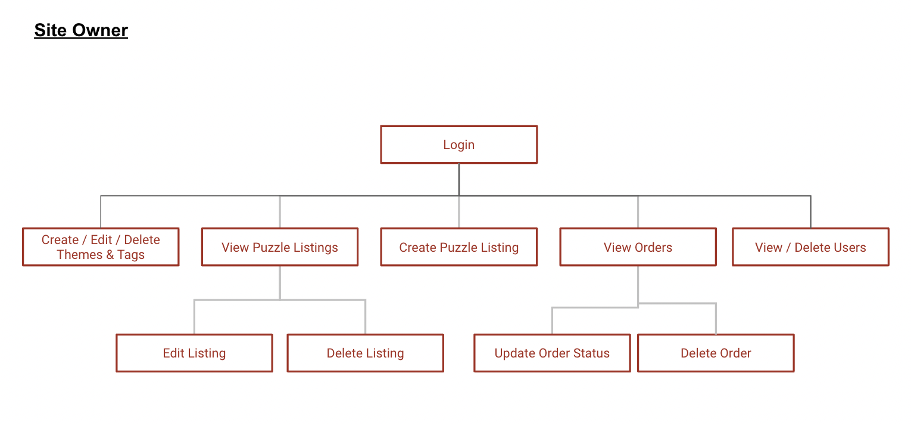

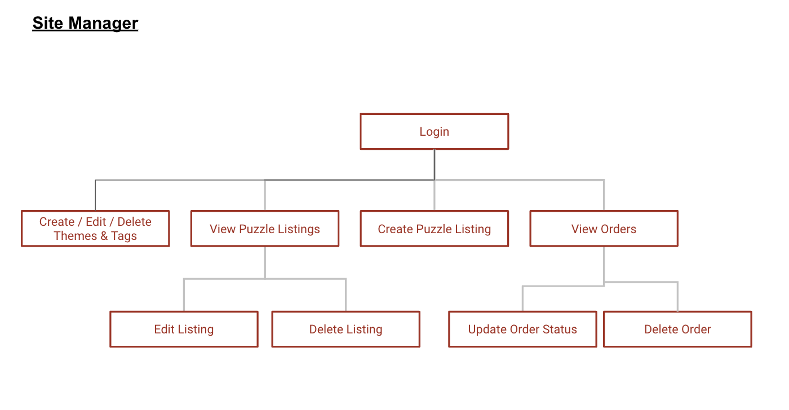

**User Site**
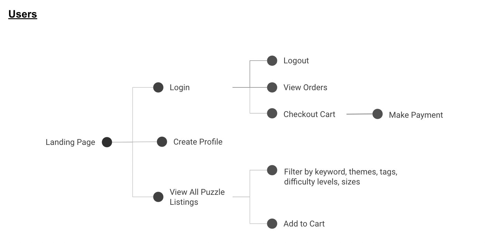

## 2D. Skeleton

**User Site**

<u>Landing Page</u>
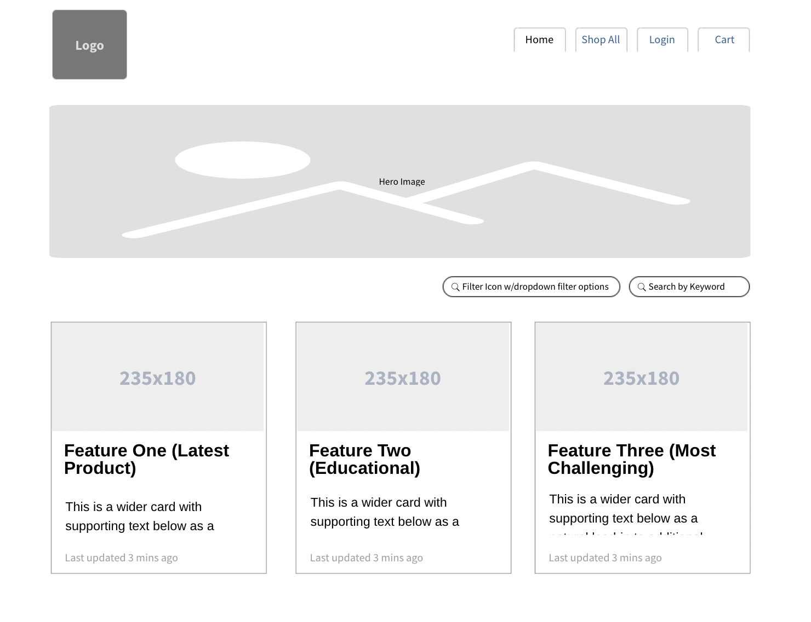

<u>Listing Page</u>
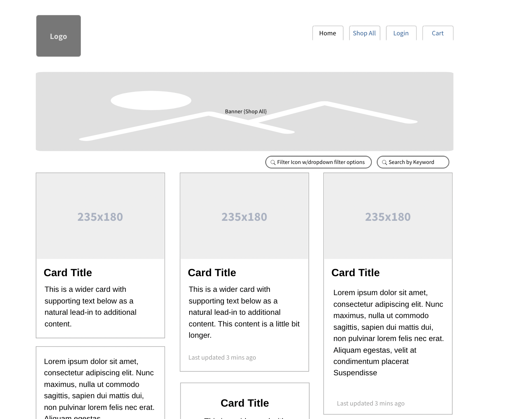

<u>Login Page</u>
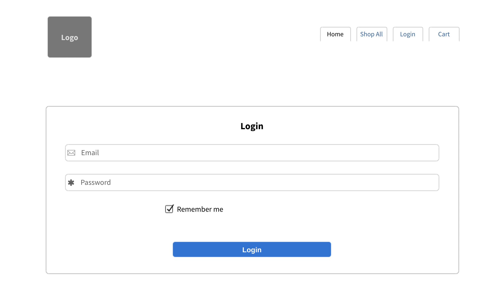

<u>Register Page</u>
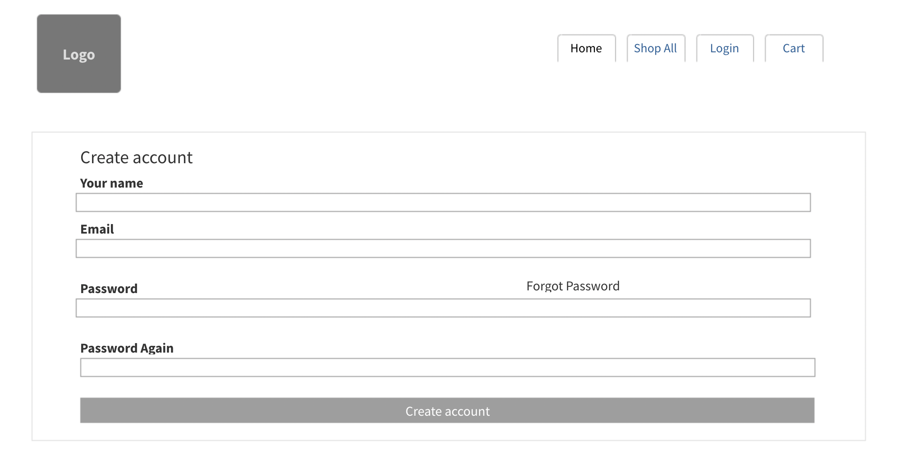

<u>Cart Page</u>
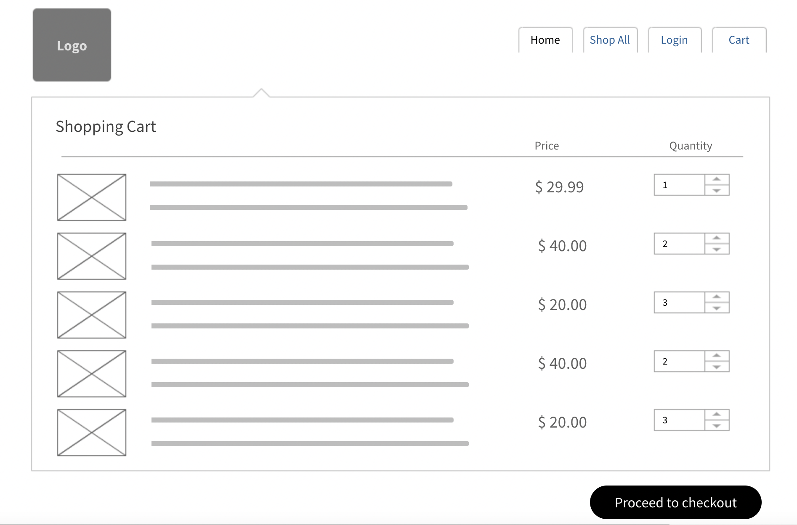

<u>Order Page</u>
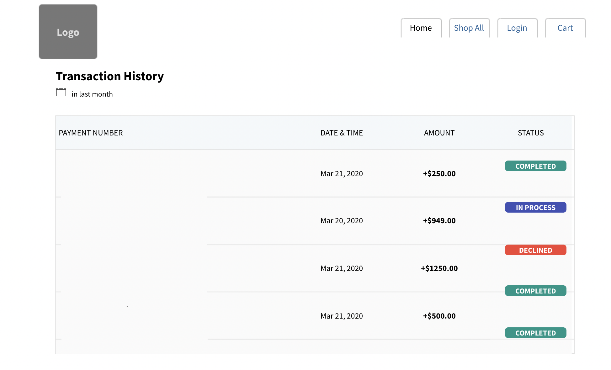

## 2E. Surface 

* Colors: Colours which give a positive yet serious tone (Solid colour Scheme) as shoppers are mostly adults (Parents and puzzle lovers)

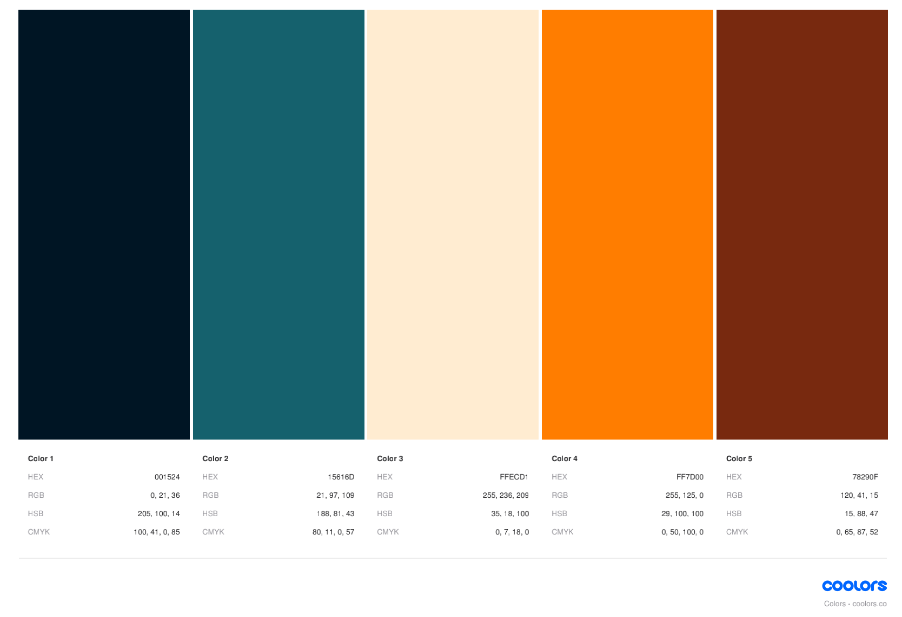

* Typography (Google Font Family):
    - 'Playfair Display', serif;
    - 'Barlow', sans-serif;
    - 'Lato', sans-serif;

    - For labels and headings, we will be using serif font type “Playfair Display” to set a more formal tone to the website as most users are parents and adults.

    - For other content such as descriptive content about the product, we will be using the sans-serif fonts.

* Font size: 
Generally normal font size for normal text content describing products as it is catered for adults.
For headings and labels, the font size will be larger so as to bring the users attention to where to click to access the different pages.

* Layout: Simple layout, straight to point tabs and buttons where users easily navigate through the page

* Strategy for achieving mobile responsiveness: Website was built from mobile size (XS) and eventually for Ipad and Laptop display

* Overall theme and words used are more serious and keyword focused.

## 3. Comprehensive Feature List 

**3A. For B2C: Customers looking to purchase jigsaw puzzles**

| # | Feature | Description | 
|---|:-------:|------------:|
|1|Register Account| User enters username, email and password to create an account|
|2|Login| User can login to the website to view their account, orders and cart|
|3|Browse Listings| User can view all available listings on the page and individual listing details|
|4|Add to Cart|User can select an item and add it to cart| 
|5|View Cart|User can view item which were added inside the cart, subtotal of each item, increase/decrease quantity of each item and remove item from cart|
|6|Checkout|User can checkout and make payment via Stripe by entering shipping address and credit card details|
|7|Search Product| User can search and filter listings by keyword, price, themes, tags, difficulty level, age group and size | 

**3B. For Site Owner and Site Manager**

| # | Feature | Description | 
|---|:-------:|------------:|
|1|Login| Login to the admin site|
|2|Browse Listings| Admin can can view all available listings on the page and individual listing details|
|3|Create New Listing| Admin can create new listing by inputting all the required information and attaching an image of the item and add it to the database|
|4|Update Listing| Admin can update individual listing details such as title, stock, theme, tags, etc|
|5|Delete Listing| Admin able to delete listing from database |
|6|View Orders| Admin can view all orders, their order items and status|
|7|Edit Order| Admin can edit address and status of the order| 
|8|Delete Order| Admin can delete order from database| 
|9|Listing Fields| Admin can view, create, edit, delete listing fields such as "Themes"| 
|10|View Existing Users| *Only Site Owner can view all existing users and their information (Except password)| 
|11|Delete Existing User| *Only Site Owner can delete a user| 

## 4. Structure of Website

**4A. For B2C: Customers looking to purchase jigsaw puzzles**

1. User can login and logout to their account.

2. User arrives at the landing page of the website and can search for puzzles and also view the latest listings.

3. Users can click on the 'listing' tab to bring them to the 'listing' page where they can view all the listings and also search/filter for puzzles by various criterias such as keyword, sizes age groups etc.

4. In the listing page, users can click on the individual listings which opens a pop up, displaying information on the specified puzzle item.

5. Users can do a quick add to cart from the main listing page or add to cart from the individual item pop up box.

6. Users can go the cart and view all the items that they have added to the cart.

7. From the cart, users can checkout and will be redirected to the Stripe payment site.

8. Users can view their profile information and orders in the profile page.

**4B. For Site Owner**
1. Owner / Manager can login / logout on the admin site.

2. Owner / Manager can view all puzzle listings and update / delete a puzzle product.

3. Owner / Manager can create a new puzzle product.

4. Owner / Manager is able to view all orders and their status.

5. Owner / Manager can update status of order and shipping address (in the event that customer makes an error and email in to amend).

6. Owner / Manager can delete an order.

7. Owner / Manager can view, create, update and delete new tags and themes for the puzzle listing fields.

8. Owner can view all registered users and their role type.

9. Owner can delete a user.

## 5. Technologies Used

1. HTML
-  A markup language which provides the structure of a website to be displayed on web browsers.

2. CSS (Cascading Style Sheet)
-  A style sheet language used for describing the presentation of a document written in this HTML page.

3. JavaScript
- Programming language which creates dynamic behaviour to a webpage. It will execute actions and create interaction between the website and their users.

4. React
- A front-end JavaScript library for building websites with user interface components.

5. MySQL / Postgres
-  Relational database management system. 

6. Express
- Unopinionated web framework for Node.js. A middleware for processing incoming requests and sending back responses.

7. Heroku
- Cloud platform that allows us to host our server.

8. Netlify
- Platform that allows us to host our static browser page.

9. Bootstrap
- CSS Framework for building responsive, mobile-first sites.

10. React Moment (On Front End React)
- Custom display dates and times in JavaScript.

11. Axios (On Front End React)
- Promise based HTTP client for the browser.

12. React Icons (On Front End React)
- Library  which consolidates famous icons libraries such as Font Awesome and Hero Icons for websites.

13. Google Fonts (On Front End React)
- Library which includes free and open source font families.

14. Cloudinary (On Express)
- Cloud-based image management service which enables users to upload and store images for websites.

15. Caolan Form (On Express)
- Form library for form creation and validation.

16. Handlebars (On Express)
- Compiles templates into JavaScript functions.

17. Wax On (On Express)
- Adds support to Handlebars for template inheritance with the block and extends helpers.

18. DB-Migrate (On Express)
- Database migration framework for node.js.

19. Bookshelf (On Express)
- JavaScript ORM for Node.js, built on the Knex SQL query builder. 
- Simple library for common tasks when querying databases in JavaScript, and forming relations between these objects.

20. Express-Session (On Express)
- Session middleware for Node JS.

21. Express Flash Message (On Express)
- Provides Express.js flash message middleware that work for rendering or redirecting.

22. Express CSURF (On Express)
- Create a middleware for CSRF token creation and validation.

23. Node-jsonwebtoken (On Express)
- JsonWebToken implementation for node.js.

24. Stripe Checkout
- Secure payment platform for online payments.

## 6. Testing Steps

**6A. For B2C User: Customers looking to purchase puzzles**

| Test Case # | Test Case Description | Test Steps| Expected Result | 
|-------------|:---------------------:|----------:|----------------:|
|01.          | View all listings     | User clicks on 'listing' tab| Page displays all listing|
|02.          | Filter listings       |           |                 |
|02A.         |                       | Keyword search "buffalo"    | Displays all listings with "buffalo" mentioned inside description or title|
|02B.         |                       | Search by Theme "Nature"| Displays all listings with Theme "nature"|
|02C.         |                       | Filter by price greater than 50| Display listings with price greater than 50|
|02D.         |                       | Filter by price less than 50| Display listings with price less than 50|
|02E.         |                       | Filter by  greater than 50 and less than 100| Display listings with price greater than 50 but less than 100|
|03.          | Login to Account      |           |                 |
|03A.         |                       | Enter credentials email and password which exist in the database| Successful login to account|
|03B.         |                       | Enter credentials email and password which does not exist in the database / incorrect from database| Unsuccessful login to account|
|04.          | Add to Cart           | User clicks add to cart from listings| Item successfully added to cart|
|05.          | Checkout              | User clicks checkout on cart page.   | User redirected to Stripe Payment Page|
|06.          | View Orders           | User clicks on 'profile' tab| Orders displayed|
|07.          | View Profile          | User clicks on 'profile' tab| Profile displayed|
|08.          | Logout Account        | User clicks on Logout| Logout Successful|
|09.          | Create Account        |           |                 |
|09A.         |                       | Create account by filling up required fields| Successful account creation|
|09B.         |                       | Missing fields or empty form| Unsuccessful account creation|

**6B. For Site Owner / Manager**

| Test Case # | Test Case Description | Test Steps| Expected Result | 
|-------------|:---------------------:|----------:|----------------:|
|01.          | Login                 |           |                 |
|01A.         |                       | Enter email and password which exists in the database| Successful login|
|01B.         |                       | Enter email and password which does not exists / does not match in the database| Failed login|
|02.          | View all listings     | Clicks on 'listing' tab| Page displays all listing|
|03.          | Create New Puzzle product|           |              |
|03A.         |                       | Enters all required puzzle listing fields such as title, cost and upload product image| Successful creation|
|03B.         |                       | Submit empty form / form with missing fields | Unsuccessful creation|
|04.          | Edit Puzzle Listing   |           |                 |
|04A.         |                       | Fills in all the form fields correctly| Listing successfully edited and redirected to all listings|
|04B.         |                       | Submits empty edit listing form or form fields not filled| Alert to check through the form fields again |
|05.          | Delete Listing        | Clicks delete listing button and confirm to delete| Successfully delete listing|
|06.          | View Listing Form Fields| Clicks 'listing fields' tab | Page displays some form fields such as 'Themes'|
|07.          | Create New Listing Form Field|    |                 |
|07A.         |                       | Fills in listing form field as 'Anime' under 'Themes'| Successfully creation and redirected to listing form field 'Themes'|
|07B.         |                       | Submits empty new listing form field under 'Themes'| Failed submission|
|08.          | Edit Listing Form Fields|         |                 |
|08A.         |                       | Fills in edited listing form fields for 'Themes' correctly| Successfully edited and redirected to listings form field 'Themes'|
|08B.         |                       | Submits empty edit form| Failed submission|
|09.          | Delete Listing        | Clicks delete for 'nature' listing form field and confirm to delete| Successfully delete 'nature'|
|10.          | Update Order Status.  |           |                 |
|10A.         |                       | Update Order Status from 'paid' to 'preparing delivery'| Successfully updated|
|10B.         |                       | Update to previous status / skip statuses | Order status cannot be updated|
|11.          | Delete Order          | Clicks delete order and confirms to delete | Order successfully deleted|
|12.          | View all registered users **Only for Owner**| Clicks on 'Users' tab| All registered users displayed|
|13.          | Delete user **Only for Owner**| Clicks delete user and confirms.   | Success deletion|

## 7. Future Features Implementation / Bugs

## 8. Deployment Steps

## 9. Credits
All images and content used are for educational purposes.